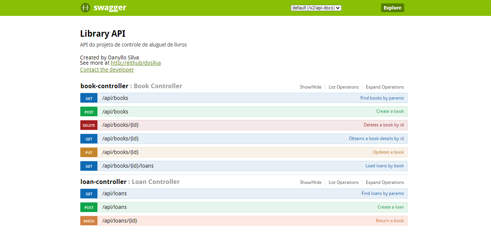
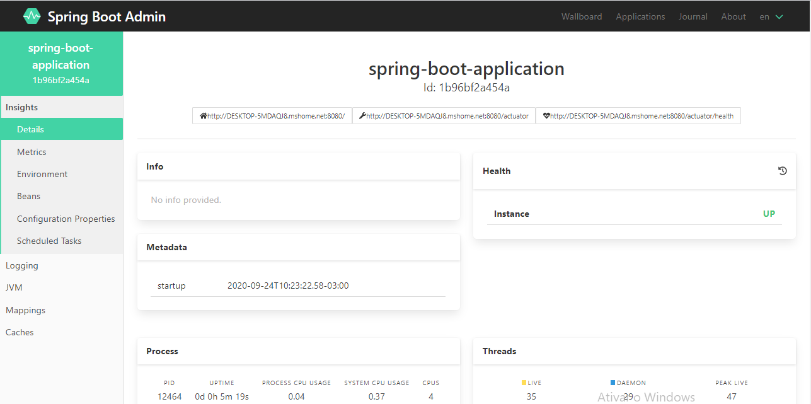

# Design de API's RestFul com Spring Boot, TDD e o novo JUnit5

Descrição: API's RestFul de alto nível com Spring Boot utilizando TDD e o novo JUnit 5.

Link: https://www.udemy.com/share/102s3iAEQdcFtQQng=/

## 💻 Projeto do curso

API de cadastro de Livros e Empréstimos com CRUD completo (busca, listagem, inserção, atualização e exclusão.

## :camera: Demonstração

## :rocket: Conceitos e tecnologias

✔️ Spring Boot

✔️ API RestFul

✔️ Banco de dados H2Database

✔️ Testes automatizados (TDD e BDD) - JUnit 5, Mockito e Mocks

✔️ Lombok

✔️ ModelMapper

✔️ DTO (Data Transfer Object)

✔️ Sub-recursos, envio de e-mails e agendamento de tarefas

✔️ Documentação de APIs com Swagger

✔️ Logs, Métricas e Monitoramento da API com Actuator e Spring Boot Admin

✔️ Testes de APIs com Insomnia e Postman

✔️ Integração contínua envolvendo o Github e o Travis CI

✔️ Cobertura de código com Jacoco e Codecov

✔️ Deploy na nuvem com Heroku

## :phone: Contato

 Linkedin [https://www.linkedin.com/in/danyllo-valente-da-silva-3569b460](https://www.linkedin.com/in/danyllo-valente-da-silva-3569b460)

:postbox: E-mail [danyllo.dvs@gmail.com](danyllo.dvs@gmail.com)
